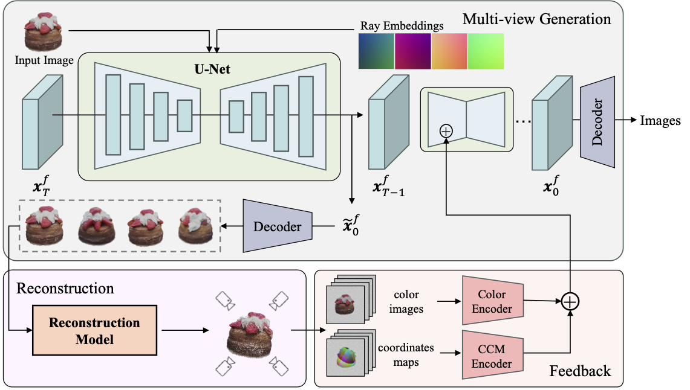

# Ouroboros3D

[WIP] Ouroboros3D: Image-to-3D Generation via 3D-aware Recursive Diffusion

## 🏠 [Project Page](https://costwen.github.io/Ouroboros3D/) | [Paper](https://arxiv.org/abs/2406.03184)

TL;DR. _Ouroboros3D, a unified 3D generation framework, which integrates diffusion-based multi-view image generation and 3D reconstruction into a recursive diffusion process. During the multi-view denoising process, the multi-view diffusion model uses the 3D-aware maps rendered by the reconstruction module at the previous timestep as additional conditions._

## 🔨 Method Overview



## 🤝 Acknowledgement

We appreciate the open source of the following projects:

[diffusers](https://github.com/huggingface/diffusers) &#8194;
[LGM](https://github.com/3DTopia/LGM) &#8194;
[EpiDiff](https://github.com/huanngzh/EpiDiff)

## 📎 Citation

If you find this repository useful, please consider citing:

```
@article{wen2024ouroboros3d,
  title={Ouroboros3D: Image-to-3D Generation via 3D-aware Recursive Diffusio},
  author={Wen, Hao and Huang, Zehuan and Wang, Yaohui and Chen, Xinyuan and Qiao, Yu and Sheng, Lu},
  journal={arXiv preprint arXiv:2406.03184},
  year={2024}
}
```
